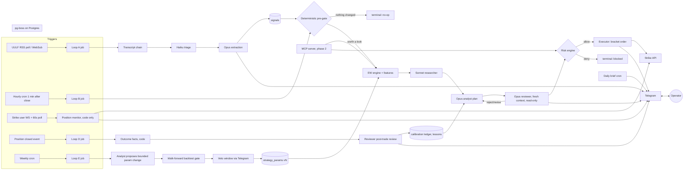

# Surf — Game Plan v0.1

_Autonomous Bitcoin 1h trading system: Elliott Wave analysis seeded by the More Crypto Online channel, executed on Strike Finance perpetuals, governed by a loop-engineered multi-agent harness with an independent reviewer and a closed feedback loop._

Status: **design proposal, awaiting decisions in §13.** Nothing here is deployed. Research backing every claim is in `docs/research/`.

---

## 1. What the research settled

These facts shape the design more than anything else. Full detail and sources in the research reports.

**Strike Finance** (`research/01-strike-finance.md`)

- V2 is an off-chain central limit order book. Trading is plain HTTPS with **Ed25519 request signing** via an "API wallet" registered in the web app. No Cardano transaction building, no seed phrase in the bot, and the API wallet **cannot withdraw**. This is a much better security posture than expected.
- `BTC-USD` perp, USD-margined, up to 100x on small notional, taker 0.05%, **maker rebate −0.005%**, funding paid **hourly** (max ±0.5%/h). Mark price drives PnL, liquidation and default trigger orders.
- **Native bracket orders** (`POST /v2/order/strategy`): a resting limit entry with attached stop-loss and take-profit legs that go live on fill and cancel each other. This is exactly the "resting trade with proper SL/TP" requirement, handled server-side.
- Liquidity is **thin** (~$2M/day volume, ~$1.30 spread). Position sizes must stay small relative to book depth; market orders should be rare.
- A **testnet** exists (`api-v2-testnet.strikefinance.org`) but onboarding (faucet, API-wallet registration) is undocumented. Needs a question to Strike's team.
- Strike exposes 1h klines (index/mark/last) since 2026-03-20, plus funding, OI and long/short history. Public and user WebSockets mirror Binance futures formats.

**Loop engineering** (`research/02-loop-engineering-and-harness.md`)

- The linked paper is a practitioner synthesis (no author byline). Its useful content: a loop = discovery + isolation + **verification by a separate skeptical agent** + persistence + scheduling; "anything deterministic logic can solve never goes to a probabilistic model"; cap budgets before shipping; a loop that never says no to itself has no real check.
- Macedo's verification ladder is the discipline we adopt: L1 deterministic checks and L2 schema/policy checks are the autonomous zone; L4 model-as-judge is never treated as L1; terminal states are named and "exhausted budget" is never success.
- Trading-specific: outcome embargo on memory (no look-ahead), state store read-only to the LLM, transaction costs modeled.

**Ingestion, data, Elliott Wave** (`research/03-ingestion-telegram-data-elliott-wave.md`)

- MCO channel ID `UCngIhBkikUe6e7tZTjpKK7Q`; ~4–6 long-form videos/day, 1–2 on Bitcoin, plus Shorts duplicates. A hidden long-form-only RSS feed (`playlist_id=UULFngIhBkikUe6e7tZTjpKK7Q`) gives clean, keyless detection. Titles contain "Bitcoin"; filter on that.
- Transcripts are the fragile link: the official captions API refuses third-party videos, and scraping libraries are blocked from cloud IPs. Recommended chain: Supadata ($5/mo) → youtube-transcript-api via residential proxy → yt-dlp audio + Deepgram.
- Binance and Bybit block US and many cloud IP ranges even for public data. Hosting geography decides the market-data stack.
- No production-grade Elliott Wave library exists in any language. Automated EW has no demonstrated out-of-sample edge. LLMs hallucinate pivots on chart images. What works: deterministic swing detection + hard-rule validation + Fib scoring, with the LLM reasoning over _structured_ swing data and reconciling against the analyst's stated count.

**Runtime** (`research/04-runtime-and-mcp.md`)

- Claude Agent SDK gives us subagents with per-role models, tool restrictions, `PreToolUse` hooks that run before any permission logic, structured outputs, and per-run budget caps. Fresh session per cycle seeded from the database, per Anthropic's own guidance.
- MCP spec 2026-07-28 and TypeScript SDK v2 are current; a bearer-token Streamable HTTP server is sufficient for phase 2.

---

## 2. Trading strategy design

The strategy is a **confluence system**, not "trade whatever the video says." Three independent views must agree before capital is committed, and the deterministic layer always owns the stop.

### 2.1 Three views

| View                       | Produced by                                                                                                                                             | Output                                                                                             |
| -------------------------- | ------------------------------------------------------------------------------------------------------------------------------------------------------- | -------------------------------------------------------------------------------------------------- |
| **Analyst prior**          | MCO transcript → LLM extraction                                                                                                                         | `{primary_count, alt_count, bias, key_levels[], invalidation, targets[], timeframe, published_at}` |
| **Independent wave count** | Deterministic engine (ZigZag → candidate enumeration → hard rules → Fib scoring) on 1h and 4h Strike index klines, cross-checked against a second venue | Top-k counts, each with an explicit invalidation price and target zones                            |
| **Market context**         | Research agent (Sonnet) over funding, OI, liquidation clusters, macro calendar, news RSS                                                                | Regime tag, event risk in next 24–48h, funding drag estimate                                       |

### 2.2 Entry logic

1. Deterministic engine and analyst prior agree on **direction** and on a **structural invalidation level** within a tolerance band. Disagreement = no trade (logged as a calibration data point).
2. Preferred setups on the 1h: end of wave 2 or wave 4 corrections (Fib 50–61.8% and 23.6–38.2% zones respectively) inside a higher-degree impulse, or end of wave C of a correction. These have defined invalidation (the wave-1 origin or the wave-1 high for W4) and asymmetric targets (W3 = 1.618×W1, W5 ≈ W1).
3. Entries are **resting limit orders** placed in the Fib zone as a Strike bracket order with SL just beyond the structural invalidation and TP at the first Fib target cluster. Post-only where possible to earn the maker rebate.
4. Minimum reward:risk 2.0 after fees and estimated funding over the expected hold; otherwise no order.
5. Momentum confluence adds confidence, never replaces structure: RSI/MACD divergence at wave-5 or wave-C terminations, wave-3 volume/RSI extremes.
6. Only one BTC position at a time in v1. Scale-outs (partial TP) are a v1.1 feature once bracket-leg replacement semantics are confirmed on testnet.

### 2.3 Sizing, leverage, funding

- Risk per trade is a fixed fraction of equity (default proposal **1%**, capped at 2%), scaled 0.5–1.0× by reviewer-adjusted confidence. Position size = risk / stop distance; leverage is whatever that size implies, **capped at 5x in v1** regardless of what Strike allows. Isolated margin per symbol so a bad trade cannot touch the rest of the account.
- Funding is charged hourly on the hour. Expected funding over the planned hold is computed from the live rate and subtracted from expected reward before the R:R test. Positions held through funding at extreme rates (> 0.05%/h against us) trigger a review.
- Because Strike's book is thin, max position notional is also capped at a fraction of visible depth within 0.5% of mid (deterministic check on `/v2/depth`).

### 2.4 Position management

- Deterministic monitor (code, no LLM) runs on the user WebSocket plus a 60s poll: reconciles positions and open orders, detects fills, tracks MAE/MFE, moves stop to breakeven after +1R (configurable), trails behind confirmed higher-degree swings, and **flattens immediately** on structural invalidation breach even if the exchange stop has not triggered.
- Resting entries expire: cancelled if unfilled after N bars or if the wave count that justified them is invalidated.
- New MCO video while a position is open triggers a re-evaluation cycle; the reviewer decides hold / tighten / exit, but cannot widen the stop.

### 2.5 What the LLMs never decide

Stop placement beyond the deterministic invalidation, position size arithmetic, leverage, whether risk limits are breached, order submission, PnL computation. These are code, tested, and enforced by hooks.

---

## 3. System architecture



### 3.1 The five loops

| Loop                     | Trigger                                           | Actors                                                                                                                                                              | Verification                                                                                                                           | Terminal states                                                                                       |
| ------------------------ | ------------------------------------------------- | ------------------------------------------------------------------------------------------------------------------------------------------------------------------- | -------------------------------------------------------------------------------------------------------------------------------------- | ----------------------------------------------------------------------------------------------------- |
| **A. Signal ingestion**  | New MCO video matching `/bitcoin                  | btc/i`                                                                                                                                                              | Transcript chain (code) → Haiku triage (is it BTC Elliott Wave analysis? substantive?) → Opus extraction into the analyst-prior schema | L2 schema validation; a cheap second model spot-checks that extracted levels appear in the transcript | `ingested`, `not-relevant`, `transcript-unavailable` (retries 6h), `blocked` |
| **B. Decision**          | Hourly candle close +1 min, and on any new signal | Deterministic pre-gate → EW engine → Sonnet researcher → Opus analyst → **Opus reviewer** (fresh context, different prompt, no order tool) → risk engine → executor | Reviewer L4, then L1 risk gates and hooks; max 2 revise rounds                                                                         | `traded`, `resting-placed`, `hold`, `no-op`, `blocked`, `exhausted`                                   |
| **C. Position monitor**  | WebSocket events + 60s poll                       | Code only                                                                                                                                                           | L1                                                                                                                                     | continuous; emits alerts                                                                              |
| **D. Post-trade review** | Position closed or resting order expired          | Code computes outcome facts → reviewer classifies decision quality vs outcome, proposes ≤1 lesson                                                                   | L3 realized PnL + L4                                                                                                                   | `reviewed`                                                                                            |
| **E. Calibration**       | Weekly, or every 10 closed trades                 | Analyst proposes one bounded parameter change → walk-forward backtest on stored cycles → Telegram veto window → activate as new params version                      | L1 backtest gate, L5 veto door                                                                                                         | `applied`, `rejected`, `vetoed`                                                                       |

**The pre-gate in Loop B is the cost control.** Most hours nothing changes. The gate runs the deterministic EW engine and a handful of cheap checks (new swing confirmed? price entered a Fib zone? new signal since last cycle? open position or resting order exists? funding extreme? scheduled macro event within 2h?). Only if any fire do the LLM stages run. Expect 4–8 LLM cycles per day, not 24.

### 3.2 Agent roster

| Agent                          | Model                                                                                                  | Tools                                                                                | May                                                                | May not                                                 |
| ------------------------------ | ------------------------------------------------------------------------------------------------------ | ------------------------------------------------------------------------------------ | ------------------------------------------------------------------ | ------------------------------------------------------- |
| Triage                         | Haiku 4.5 via Messages API                                                                             | none                                                                                 | classify relevance, summarize                                      | anything else                                           |
| Extractor                      | Opus 5                                                                                                 | read transcript                                                                      | produce analyst-prior JSON with quoted evidence spans              | infer levels not stated                                 |
| Researcher                     | Sonnet 5                                                                                               | market-data tools, news RSS, WebSearch (allow-listed domains)                        | compile context brief ≤1.5k tokens                                 | opine on direction                                      |
| Analyst                        | Opus 5                                                                                                 | read-only market tools, EW engine output, signals, calibration table, current params | produce a trade plan JSON with evidence IDs, or "no trade"         | place orders, change params                             |
| **Reviewer**                   | Opus 5, different system prompt, fresh context (Fable 5.1 if evals show Opus-on-Opus is too agreeable) | read-only market tools, recompute helpers                                            | approve / revise / reject with reasons; adjust confidence downward | approve without recomputing size and stop; place orders |
| Post-trade reviewer            | Opus 5                                                                                                 | trade record, outcome facts                                                          | classify, propose one lesson                                       | edit knowledge directly                                 |
| Executor, risk engine, monitor | **no model**                                                                                           | Strike API                                                                           | everything that touches money                                      | —                                                       |

Every agent runs as a fresh Agent SDK session per cycle with `permissionMode: "dontAsk"`, `tools: []` plus explicit in-process tools, `maxTurns`, and `maxBudgetUsd`. A `PreToolUse` hook on `place_order` denies unless a `risk_decision` row with `verdict='allow'` exists for that exact proposal hash.

### 3.3 Feedback loop mechanics

- **Journal at entry**: thesis, signal IDs, EW count ID, expected move, invalidation, confidence bucket, params version, knowledge version, model IDs, prompt hashes.
- **Outcome facts by code**: realized R, MAE/MFE, hold time, fees, funding paid, slippage, whether invalidation or target was hit first.
- **Calibration ledger**: hit rate and Brier score per confidence bucket; realized edge after costs per setup type (W2 end, W4 end, C end) and per signal source; how often the "primary count" survived N bars; MCO thesis accuracy vs our independent count accuracy.
- **Outcome embargo**: post-trade reviews are not retrievable by the analyst until the trade is closed and the embargo elapsed; no look-ahead.
- **Lessons are curated, not appended**: each lesson carries evidence trade IDs and is re-evaluated after 10 further trades; kept or discarded on evidence.
- **Strategy knowledge and parameters are versioned** in the database and git; every decision records which version it ran under, so PnL can be attributed and a version rolled back.

---

## 4. Autonomy and safety model

You asked for full autonomy on trading decisions. The design honors that: no trade requires approval. Autonomy is bounded by deterministic limits that no agent can change at runtime, and by a small number of **veto windows** rather than approval gates.

**Hard limits (code, config-only, no LLM access):** max risk per trade, max leverage, max concurrent positions, max daily loss, max drawdown from high-water mark, max orders per hour, min time between entries, max notional vs book depth, stale-data refusal, reference-price deviation refusal.

**Automatic halts (`trading_halted` flag):** daily loss or drawdown breach, N consecutive stop-outs in a window, exchange error circuit breaker, position/order reconciliation mismatch, dead-man's switch (no heartbeat for 2 cycles, checked by a separate process). While halted, the monitor still manages open positions and stops; no new entries.

**Veto windows (autonomous unless you object):** re-arming after an automatic halt, activating a Loop E parameter change, activating a strategy-knowledge update. Telegram posts the proposal with a countdown (proposed default: 12 hours); silence means proceed. Reply `/veto <id>` to block. This is the "keep one door open" principle without making you an approval bottleneck. If you would rather these also be fully automatic, that is a one-line config change, but the research is unanimous that unsupervised self-modification is where loops go bad.

**Prompt-injection posture:** transcripts and news are untrusted data, delimited and labeled as such; they never flow into tool arguments; the extractor must quote evidence spans; a title or transcript cannot cause an order because orders require the full B-loop with reviewer and risk engine.

**Budgets:** per-cycle and daily USD caps on LLM spend; `exhausted` is a terminal state that alerts you and is never logged as success.

---

## 5. Telegram interface

Single allow-listed chat. HTML parse mode. Long polling (no inbound port needed).

**Pushed to you:** new video ingested (title, extracted primary/alt/invalidation, relevance verdict); decision cycle outcome when it is not `no-op` (plan summary, reviewer verdict and reasons, risk verdict, order placed with entry/SL/TP/size/leverage); fills, stop moves, exits with realized R; halts and veto windows; pipeline failures; **daily brief** at a time you choose (positions, PnL today/7d/30d, open resting orders, latest MCO thesis vs our count, calibration snapshot, funding/OI regime, macro events next 48h, LLM spend).

**Commands:** `/pnl [today|7d|30d|all]`, `/positions`, `/orders`, `/brief`, `/why <trade_id>`, `/count` (current EW candidates), `/status` (heartbeat, feed health, last error, spend), `/pause` (new entries only, or pause + flatten, via inline keyboard with nonce), `/resume`, `/veto <id>`, `/limits` (read-only view of hard limits). Free-text questions ("how did we do on the last W4 long?") route to a Sonnet answerer with read-only DB tools.

---

## 6. Data and storage

Postgres 17. Core tables: `candles` (venue-tagged, 1h and 4h), `funding`, `open_interest`, `videos`, `transcripts`, `signals` (analyst prior), `ew_counts` (engine output per cycle), `cycles`, `stages` (per-stage inputs/outputs/usage/cost, enabling crash-safe resume), `research_briefs`, `proposals`, `reviews`, `risk_decisions`, `orders`, `fills`, `positions`, `trade_journal`, `trade_reviews`, `lessons`, `calibration`, `strategy_params_versions`, `knowledge_versions`, `heartbeats`, `telegram_outbox`. Raw LLM request/response bodies to disk via OTEL file exporter, retained 90 days.

---

## 7. Tech stack

| Layer           | Choice                                                                                                                                           |
| --------------- | ------------------------------------------------------------------------------------------------------------------------------------------------ |
| Language        | TypeScript, Node 22 LTS, pnpm, strict mode, Zod schemas shared across agents/MCP/Telegram                                                        |
| Agents          | Claude Agent SDK (analyst, researcher, reviewer, extractor); Messages API for Haiku triage                                                       |
| Queue/scheduler | pg-boss (cron, singleton keys, retries) with a `stages` checkpoint table                                                                         |
| Database        | Postgres 17 (Docker), Drizzle ORM, nightly `pg_dump`                                                                                             |
| Exchange        | Hand-written Strike V2 client generated from the vendored OpenAPI specs; Ed25519 via `@noble/ed25519`; user + public WebSocket clients           |
| Market data     | Strike index klines as execution truth; Coinbase or Binance (geo-dependent) as second venue and long history; Coinalyze for aggregate OI/funding |
| Transcripts     | Supadata → youtube-transcript-api (residential proxy) → yt-dlp + Deepgram                                                                        |
| Telegram        | grammY, long polling                                                                                                                             |
| Hosting         | Single VPS (EU region recommended for market-data reachability), Docker Compose, systemd, Caddy for TLS (MCP phase)                              |
| Secrets         | systemd encrypted credentials or sops+age; Strike API-wallet key never in prompts                                                                |
| Observability   | OTEL + raw bodies to disk, Postgres journal, optional Langfuse Cloud                                                                             |
| Testing         | Vitest; deterministic modules (EW engine, risk engine, sizing) at 100% branch coverage; recorded Strike testnet fixtures                         |

Proposed repository layout:

```
surf/
  apps/
    daemon/           # triggers, queue workers, loops A–E, Telegram bot
    mcp-server/       # phase 2: Streamable HTTP + stdio adapter over core
  packages/
    core/             # domain services, Zod schemas, risk engine, sizing
    strike/           # Strike V2 REST + WS client, Ed25519 signing
    ew-engine/        # ZigZag, candidate enumeration, rules, Fib scoring
    market-data/      # candle/funding/OI ingestion, venue adapters
    ingestion/        # RSS watcher, transcript chain
    agents/           # Agent SDK definitions, prompts, tools, hooks
    telegram/         # grammY bot, formatters, command handlers
  docs/
    00-game-plan.md
    research/
    decisions/        # ADRs as we decide
  infra/              # docker-compose, systemd units, Caddyfile
```

---

## 8. Phased roadmap

Each phase has an exit gate. We do not put money on until the gates say so.

| Phase                                         | Scope                                                                                                                                                                                                                                                                                                     | Exit gate                                                                                                                           |
| --------------------------------------------- | --------------------------------------------------------------------------------------------------------------------------------------------------------------------------------------------------------------------------------------------------------------------------------------------------------- | ----------------------------------------------------------------------------------------------------------------------------------- |
| **0. Decisions and accounts** (this document) | Answer §13; create Strike account + API wallet; ask Strike about testnet onboarding; Telegram bot token; Anthropic key; VPS                                                                                                                                                                               | All credentials in hand; ADRs written                                                                                               |
| **1. Foundations** (paper mode)               | Monorepo scaffold; Postgres + pg-boss; Strike client against testnet (or mainnet read-only) with recorded fixtures; market-data ingest and 1h/4h candle store with 2-venue cross-check; risk engine and sizing with exhaustive tests; Telegram skeleton (`/status`, `/pnl` stub); paper-execution adapter | Client places and cancels a bracket on testnet; risk engine rejects every seeded bad plan; heartbeat visible in Telegram            |
| **2. Ingestion**                              | UULF RSS watcher; transcript chain with all three fallbacks; Haiku triage; Opus extraction with evidence spans; backfill the last 30 MCO BTC videos to build an evaluation set                                                                                                                            | ≥95% of BTC videos ingested within 60 min; extraction levels verified against transcripts on the backfill set                       |
| **3. Analysis loop, shadow mode**             | EW engine on 1h/4h; researcher; analyst; reviewer; full Loop B producing plans and reviewer verdicts **without placing orders**; journal everything                                                                                                                                                       | 2 weeks of shadow decisions; reviewer rejection rate between 15% and 60%; plan JSON passes schema 100%; cost per LLM cycle measured |
| **4. Execution on testnet**                   | Executor with bracket orders; position monitor with reconciliation, breakeven/trailing, invalidation flatten; halts and dead-man's switch; Loop D post-trade review                                                                                                                                       | 3 weeks testnet; zero reconciliation mismatches; every simulated halt fires; daily brief working                                    |
| **5. Live, small**                            | Mainnet with a small float and 0.5% risk per trade; Loop E calibration with veto windows; weekly review of a decision sample by you                                                                                                                                                                       | 30 closed trades or 6 weeks; then decide on scaling risk toward the configured cap based on realized edge after costs               |
| **6. MCP server**                             | Expose `analyze_market`, `get_analysis`, `propose_trade`, `place_trade(proposal_id)`, `get_positions`, `get_calibration` over Streamable HTTP with bearer auth and stdio for local agents                                                                                                                 | Another Claude agent completes a full propose → place cycle through MCP with all risk gates enforced                                |

Rough effort: phases 1–4 are the bulk, roughly 5–7 focused build weeks with you testing along the way. Phase 5 is calendar time, not build time.

---

## 9. Running costs (estimate)

| Item                                                                         | Monthly                                                              |
| ---------------------------------------------------------------------------- | -------------------------------------------------------------------- |
| LLM spend with pre-gate (4–8 cycles/day + ingestion + reviews + daily brief) | ~$80–200                                                             |
| VPS                                                                          | ~€15                                                                 |
| Transcripts (Supadata Basic + residential proxy fallback)                    | ~$10–15                                                              |
| Market data                                                                  | $0 (public endpoints) unless Coinglass ETF/CME data is wanted (+$29) |
| Strike fees                                                                  | maker rebate on entries; taker 0.05% on stops; funding variable      |

---

## 10. Risks and honest caveats

- **No evidence of edge yet.** Neither Elliott Wave automation nor LLM trading loops have demonstrated out-of-sample profitability in the literature. The design's value is disciplined execution, hard invalidation, and measurement. Phase 3 shadow mode and phase 5 small-float live are where we find out. The calibration ledger is built specifically to answer "does MCO's count beat ours? does either beat a plain trend rule?"
- **Backtests are contaminated.** Opus 5's knowledge cutoff is May 2026; any LLM-in-the-loop backtest before that date leaks price memory. Deterministic components (EW engine, invalidation-stop framework) can be backtested honestly; the LLM layers can only be evaluated forward.
- **Thin venue.** Strike BTC-USD depth limits size and makes stop slippage material. Sizing must respect visible depth; we should measure realized slippage from day one.
- **Transcript access is brittle.** YouTube actively fights server-side transcript retrieval. Three fallbacks are planned; expect occasional multi-hour delays.
- **Single-source signal.** Depending on one analyst's channel is concentration risk. The independent count and the calibration ledger exist to detect when the prior stops adding value; extending to other sources is easy once the schema exists.
- **Self-modification is where loops fail.** Loop E is deliberately slow, bounded, backtested and vetoable.
- **Regulatory/tax.** Leveraged perp trading records should be retained; the journal covers this, but jurisdiction-specific requirements are yours to confirm.

---

## 11. Decisions needed from you

Grouped by how much they change the build. Defaults are what I will assume if you just say "go with your recommendations."

**A. Risk envelope (changes sizing, halts, everything)**

1. Starting capital on Strike, and the risk-per-trade you want (default 1%, hard cap 2%).
2. Max leverage you are comfortable with (default cap 5x in v1 even though Strike allows 100x).
3. Max daily loss and max drawdown that should halt new entries (default 3% daily, 10% from high-water mark).
4. One position at a time in v1 (default yes) or allow a hedge/second position?

**B. Autonomy boundaries** 5. Veto windows for halt re-arm, parameter changes and knowledge updates (default 12h, silence = proceed) versus fully automatic with notification only. 6. Should a new MCO video that contradicts an open position be allowed to close it autonomously (default yes, via the full reviewer loop), or only tighten stops?

**C. Infrastructure** 7. Where does this run? Recommendation: a small EU-region VPS you control (Hetzner-class). If you already have a server, home box or cloud account, say which. This decides whether Binance/Bybit data is reachable and whether transcript scraping works without a paid proxy. 8. Do you have a Strike Finance account already, funded, and have you registered an API wallet? Can you ask in Strike's Discord how to get testnet funds and a testnet API wallet? I could not find that documented. 9. Telegram: do you have a bot token and know your chat ID, or should I include setup steps? 10. Anthropic API key and a daily LLM spend cap you are happy with (default $10/day hard cap).

**D. Strategy scope** 11. Which MCO content counts: Bitcoin-titled long-form only (default), or also combined "Bitcoin & Ethereum" videos and live streams? Patreon content is excluded unless you hold an account and want to supply it. 12. Should the system trade **only** when a fresh MCO thesis (say ≤48h old) exists (default), or also on its own independent count when no video is available? 13. Reference price series for the EW count: Strike index (default, matches liquidation/funding), Coinbase BTC-USD, or Binance BTCUSDT? 14. Daily brief time and timezone.

**E. Build preferences** 15. TypeScript monorepo as proposed (default) or Python? 16. Anything you want in the MCP surface beyond the six tools listed in phase 6?

---

## 12. Immediate next actions once you answer

1. Write ADRs for the decisions above in `docs/decisions/`.
2. Scaffold the monorepo, Postgres, pg-boss, and CI (typecheck, lint, tests).
3. Build and fixture-test the Strike client against testnet (or mainnet read-only if testnet onboarding stalls).
4. Ship the Telegram heartbeat so you can watch progress from your phone from week one.
5. Start ingesting candles, funding and OI immediately, since Binance's OI history is only 30 days deep and every day of stored data helps the EW engine evaluation.
